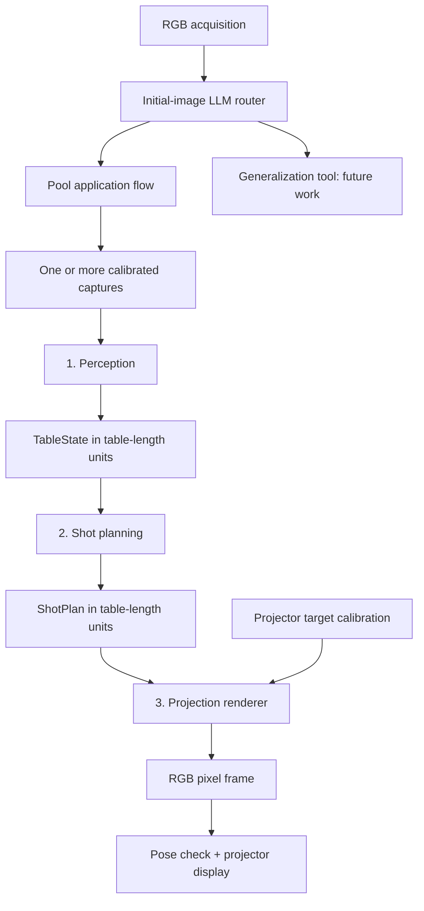

# Architecture

## Product and demo

The long-term product is a general-purpose physical AI companion with cameras, microphones, a projector, and a 360° rotating base:

**See + hear → understand → choose assistance → aim → project → observe again.**

For the first demo, an RGB camera observes a pool table from the side. Perception runs a model to estimate depth from the RGB image; there is no depth camera. The robot is roughly 1–2 m high and some distance from the table. The actual height above the cloth, distance, fields of view, and rigid mounting arrangement must be measured. The previous overhead-camera arrangement is superseded.

A multimodal LLM sees the initial RGB image and selects `pool` or `generalization`. Future audio may inform this decision. The router does not calculate ball positions, physics, or pixel warps. No LLM provider is selected or called by this skeleton.



## Package boundaries

```text
src/companion/
  app.py                       Local CLI; future application composition root
  serialization.py             Versioned JSON envelope helpers
  sensors/                     Shared camera capture data and camera protocol
  routing/                     Tool selection enum, router protocol, LLM stub
  pool/
    contracts/                 Geometry, table state, shot plan, outcomes, JSON codecs
    perception/                Teammate 1: interface.py + service.py + vision/ (OpenCV pipeline)
    planning/                  Teammate 2: interface.py + service.py
    projection/                Teammate 3: interface.py + service.py + pixel/target models
    pipeline.py                Single-batch stage composition and handoff validation
  generalization/              Future tool entry point, explicit stub
  hardware/                    Generic rotation/projector protocols
```

Use immutable dataclasses for data and `typing.Protocol` for replaceable behavior. Services compose dependencies; they do not inherit from a common robot base class. There is no global model, camera, renderer, or calibration singleton. Inject implementation-specific dependencies into service constructors as they become necessary.

Rules:

1. Perception, planning, and projection do not import one another's implementations.
2. Shared contracts contain no camera SDK, NumPy, ML, physics, or rendering dependencies.
3. `PoolPipeline` connects interfaces, not concrete services.
4. Algorithms never rotate or display directly. Hardware adapters belong at the application boundary.
5. Generalization shares generic capture and hardware interfaces, not pool contracts.
6. Rendering creates bytes; displaying those bytes is a separate operation.
7. Add internal files when there is real code to put in them. No speculative base classes, repositories, event buses, or plugin framework.

## Current public interfaces

```python
TablePerception.estimate(captures: CaptureBatch, geometry: TableGeometry) -> PerceptionResult
ShotPlanner.plan(state: TableState, game: GameContext) -> PlanningResult
ShotRenderer.render(plan: ShotPlan, target: ProjectionTarget) -> ProjectionFrame
TaskRouter.route(first_capture: CameraCapture) -> RoutingDecision
```

The concrete `PooltoolPlanner` implements Pooltool-based direct-pot search. `ProjectionService` renders calibrated guidance, with explicit HTTP output via `HttpProjector`. `PerceptionService` measures the cloth and reads the balls with a classical-CV pipeline in `perception/vision/`, for a roughly overhead capture; oblique-view depth and multi-view fusion are not implemented (see [perception.md](perception.md)). `LLMRouter` remains unimplemented. No subclass declaration is required to satisfy a protocol. Shared contracts and pipeline behavior are implemented.

## Pool orchestration

`PoolPipeline.prepare(captures, geometry, game, target)` performs one pass through the three interfaces. It returns `PreparedProjection(state, plan, frame)` or propagates an expected incomplete/unsuccessful outcome. It checks geometry identity, plan observation provenance, called ball/pocket eligibility for the current group, guide ball IDs, and output frame provenance/resolution. These are handoff checks, not a substitute for rules evaluation on simulated events.

It **does not acquire images, scan, retry, rotate, or project**. This bounded method is usable in tests before any hardware exists. The future application flow will:

1. Blank projection before capture.
2. Acquire the first image and ask the router which tool to invoke.
3. Reuse that image if it is valid for the selected tool; pool can acquire additional views.
4. Confirm balls are stationary and acquire a batch of settled, calibrated views.
5. Call the pool pipeline with a selected projection target.
6. On `NeedsMoreViews`, acquire additional views and retry with a bounded scan policy. Reject batches spanning ball motion.
7. On other expected failure outcomes, explain the issue and avoid displaying stale guidance.
8. On success, blank the projector, move to the target pose, wait for settling, and verify the current pose/calibration still matches the frame.
9. Confirm the observation remains usable, then call `projector.project(frame.rgb, frame.width_px, frame.height_px)`.
10. Observe for the next shot and invalidate guidance when balls move.

The pipeline's ID checks do not establish real-world freshness. Motion detection, calibration validity, pose verification, and rescan policy remain application responsibilities.

## Router and generalization

`ToolName` is an allowlist containing `pool` and `generalization`. A future LLM adapter must parse its response into a `RoutingDecision`; the application dispatches on that enum. Do not execute arbitrary tool names or generated Python.

Pool receives explicit `GameContext` from the UI/operator independently of the router. The MVP plans called pot attempts in 8-ball after the break with assigned groups and a placed cue ball, including the eight once the group is cleared. Ball positions alone do not identify the current player or assigned group. `ShotPlan` includes cue-stick speed separately from unit aim; physics/search remain private to planning.

Generalization has a stub `run(first_capture)` entry point. Its result schema is deliberately deferred; do not force general-purpose guidance into `ShotPlan`. Audio has no placeholder data contract yet because device and synchronization requirements are still undecided.

## Implementation progression

1. Establish contracts and independent recorded-input workflows (this scaffold).
2. In parallel: one-view localization; direct-shot planning; synthetic-plan projection and dot calibration.
3. Integrate one stationary table view into one visible projected aim line.
4. Add multi-view capture/fusion and repeatable rotating projector poses.
5. Add the LLM router, then audio and generalization.

The planner uses Pooltool 0.6.0 for direct center-ball shot simulation and a bounded heuristic search with seeded uncertainty trials. See [planning implementation](planning.md) for scoring and limits.
